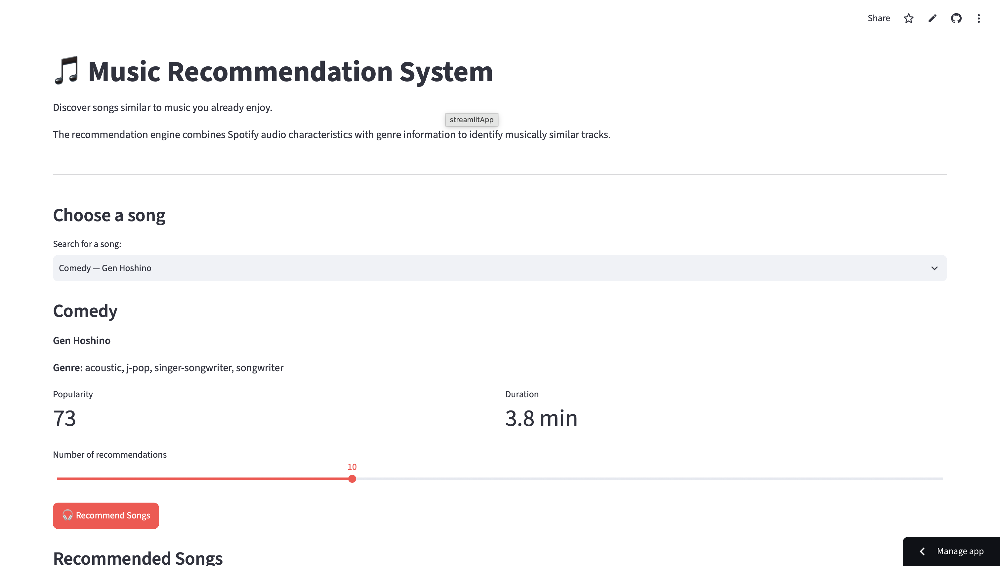

# 🎵 Music Recommendation System

A hybrid content-based music recommendation system that recommends songs based on a combination of **Spotify audio characteristics** and **genre information**.

The project compares an audio-only baseline recommendation model with an improved hybrid model and provides an interactive **Streamlit web application** for discovering similar songs.

---

## 🖥️ Application Preview



## 📌 Project Overview

Music recommendation systems help users discover songs based on their listening preferences.

This project develops a recommendation engine that identifies songs similar to a selected track using:

* Danceability
* Energy
* Loudness
* Speechiness
* Acousticness
* Instrumentalness
* Liveness
* Valence
* Tempo
* Genre information

The project started with an **audio-only nearest-neighbour model** and was later improved by adding genre features to create a **hybrid content-based recommender**.

---

## 🚀 Live Application
🔗 **Try the application:** https://music-recommendation-system-0.streamlit.app

The Streamlit application allows users to:

* Search for a song
* Select the number of recommendations
* Generate similar songs
* View popularity and similarity scores
* Compare audio features between the selected song and its top recommendation
* Read an explanation of how the recommendation system works


---

## 📊 Dataset

The project uses the **Spotify Tracks Dataset** from Kaggle.

The original dataset contains approximately:

* **114,000 records**
* **21 columns**
* Multiple Spotify audio characteristics
* Track metadata
* Genre information

### Data Cleaning

The following preprocessing steps were performed:

1. Removed the unnecessary `Unnamed: 0` column.
2. Removed records containing missing song, artist, or album information.
3. Identified duplicate Spotify track IDs.
4. Combined multiple genres associated with the same track.
5. Retained one record per unique `track_id`.

After cleaning:

* **Original records:** 114,000
* **Cleaned records:** 89,740
* **Unique tracks:** 89,740
* **Duplicate track IDs:** 0
* **Missing values:** 0

---

## 🔍 Exploratory Data Analysis

Exploratory analysis was performed before developing the recommendation models.

The analysis included:

* Song popularity distribution
* Energy distribution
* Danceability distribution
* Most common genres
* Correlation analysis between audio characteristics

Some notable relationships observed include:

* Energy and loudness are positively related.
* Acousticness and energy show a strong negative relationship.
* Danceability and valence show a positive relationship.
* Popularity has relatively weak relationships with most audio characteristics.

---

## 🤖 Recommendation Models

### Model 1 — Audio-Only Baseline

The first model uses nine standardized numerical audio characteristics:

```text
danceability
energy
loudness
speechiness
acousticness
instrumentalness
liveness
valence
tempo
```

The features are standardized using `StandardScaler`.

A `NearestNeighbors` model using **cosine distance** is then used to retrieve tracks with similar audio profiles.

### Limitation

Although songs could have highly similar numerical audio characteristics, they were sometimes stylistically unrelated.

For example, a query could return tracks from unrelated genres simply because their numerical audio characteristics were similar.

---

## 🎧 Model 2 — Hybrid Audio + Genre Recommender

The improved model combines:

* Standardized numerical audio characteristics
* Multi-label encoded genre information

Genres are encoded using `MultiLabelBinarizer`.

The two groups of features are combined into a sparse feature matrix.

The model currently applies:

```text
Audio Weight = 1.0
Genre Weight = 1.5
```

The increased genre weight encourages recommendations that are both acoustically similar and stylistically relevant.

The final recommender uses:

```text
NearestNeighbors
Metric: Cosine Distance
Algorithm: Brute Force
```

---

## 📈 Model Evaluation

Because the dataset does not contain user ratings, listening histories, or explicit relevance labels, traditional recommender-system metrics based on user interactions could not be calculated.

Instead, **Genre Consistency@10** was used as a proxy evaluation metric.

This metric measures the proportion of the top 10 recommended songs that share at least one genre with the selected song.

| Model                | Genre Consistency@10 |
| -------------------- | -------------------: |
| Audio-only baseline  |               17.64% |
| Audio + genre hybrid |           **98.26%** |

The hybrid model substantially improved genre consistency.

> **Important:** 98.26% represents genre consistency, not recommendation accuracy. Genre information is directly included in the hybrid model, so this metric primarily demonstrates that genre-aware modelling produces more stylistically consistent recommendations.

---

## 🧠 How the Recommendation System Works

### 1. Audio Feature Standardization

Audio characteristics exist on different numerical scales.

For example:

* Danceability ranges approximately from 0 to 1.
* Tempo may exceed 100 BPM.

`StandardScaler` transforms these features so they can contribute more comparably to distance calculations.

### 2. Genre Encoding

Songs may belong to multiple genres.

`MultiLabelBinarizer` converts genre labels into binary features.

### 3. Hybrid Feature Representation

Standardized audio characteristics and genre features are combined into a single sparse feature matrix.

### 4. Nearest-Neighbour Search

The recommendation engine calculates similarity using cosine distance and retrieves the closest songs.

### 5. Recommendation Filtering

Before presenting recommendations, the application removes:

* The selected track itself
* Alternate versions of the selected song
* Duplicate song-and-artist combinations

---

## 💻 Streamlit Application

The user interface was developed with Streamlit.

Users can:

1. Search for a track.
2. View the selected track's artist, genre, popularity, and duration.
3. Choose between 5 and 20 recommendations.
4. Generate recommendations.
5. View similarity and popularity indicators.
6. Compare audio characteristics between the selected song and the highest-ranked recommendation.
7. Expand a technical explanation of the recommendation methodology.

---

## 📁 Project Structure

```text
music-recommendation-system/
│
├── app/
│   └── app.py
│
├── data/
│   ├── cleaned_spotify.csv
│   └── dataset.csv
│
├── images/
│
├── models/
│   ├── evaluation_results.csv
│   ├── genre_encoder.joblib
│   ├── hybrid_recommender.joblib
│   ├── nearest_neighbors.joblib
│   └── scaler.joblib
│
├── notebooks/
│   ├── 01_data_exploration.ipynb
│   └── 02_recommendation_model.ipynb
│
├── src/
│
├── .gitignore
├── requirements.txt
└── README.md
```

The raw `dataset.csv` file is excluded from the Git repository through `.gitignore`.

---

## 🛠️ Technologies Used

* Python
* Pandas
* NumPy
* Scikit-learn
* SciPy
* Matplotlib
* Streamlit
* Joblib
* Jupyter Notebook

---

## ⚙️ Installation

Clone the repository:

```bash
git clone <repository-url>
```

Move into the project directory:

```bash
cd music-recommendation-system
```

Create a virtual environment:

```bash
python3 -m venv .venv
```

Activate it on macOS/Linux:

```bash
source .venv/bin/activate
```

Install the required dependencies:

```bash
pip install -r requirements.txt
```

---

## ▶️ Run the Application

From the project root directory, run:

```bash
streamlit run app/app.py
```

Streamlit will start the application locally, typically at:

```text
http://localhost:8501
```

---

## 🔬 Reproducing the Analysis

The project notebooks contain the complete workflow.

### Data Exploration

```text
notebooks/01_data_exploration.ipynb
```

Includes:

* Dataset inspection
* Missing-value analysis
* Duplicate analysis
* Data cleaning
* Exploratory visualizations
* Correlation analysis

### Recommendation Modelling

```text
notebooks/02_recommendation_model.ipynb
```

Includes:

* Audio-only baseline
* Feature scaling
* Nearest-neighbour modelling
* Hybrid genre-aware model
* Model evaluation
* Model serialization

---

## ⚠️ Limitations

This project currently uses a **content-based recommendation approach**.

Therefore, it does not learn directly from individual user behaviour.

Current limitations include:

* No user listening histories
* No explicit song ratings
* No collaborative filtering
* Genre consistency is only a proxy for recommendation relevance
* Recommendations are restricted to songs available in the dataset
* Audio-feature similarity does not perfectly represent subjective musical taste

---

## 🔮 Future Improvements

Possible extensions include:

* Collaborative filtering using user interaction data
* Hybrid collaborative + content-based recommendations
* Spotify API integration
* Album artwork
* Song previews
* Playlist generation
* Recommendation diversity metrics
* Precision@K and Recall@K using suitable user-interaction datasets
* Personalized user profiles
* Artist-diversity controls
* Mood-based recommendations
* Deep-learning recommendation models

---

## 📌 Key Result

Adding genre awareness significantly improved the stylistic consistency of recommendations:

```text
Audio-only baseline:       17.64% Genre Consistency@10
Hybrid audio + genre:      98.26% Genre Consistency@10
```

The final system demonstrates a complete Data Science workflow from **data cleaning and exploratory analysis through modelling, evaluation, explainability, interface development, and deployment preparation**.
  